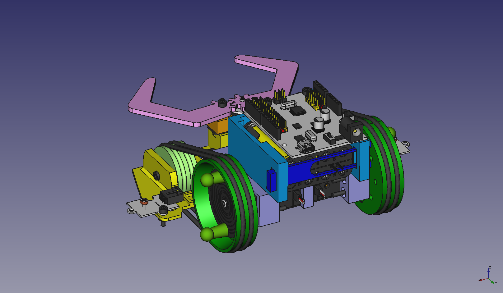
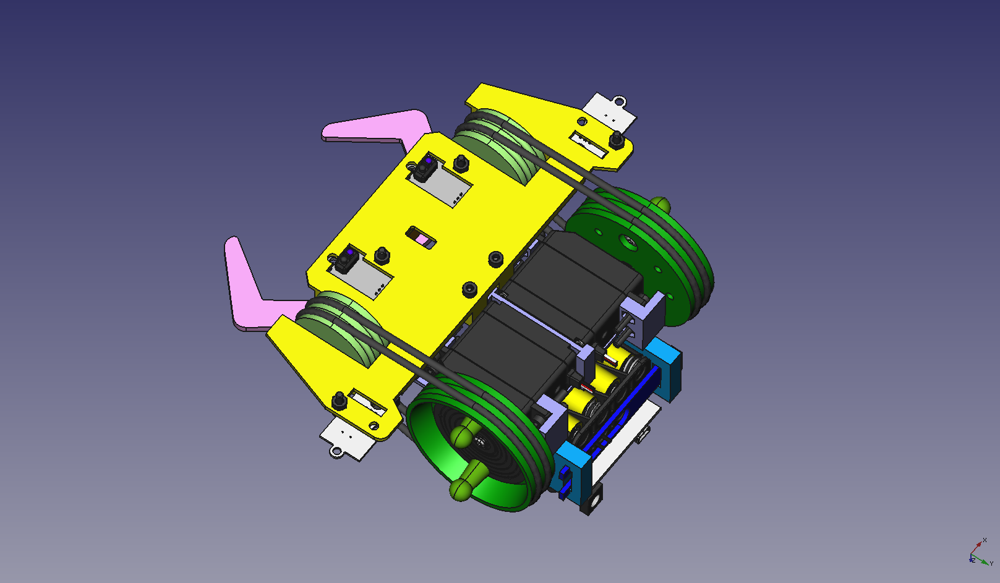
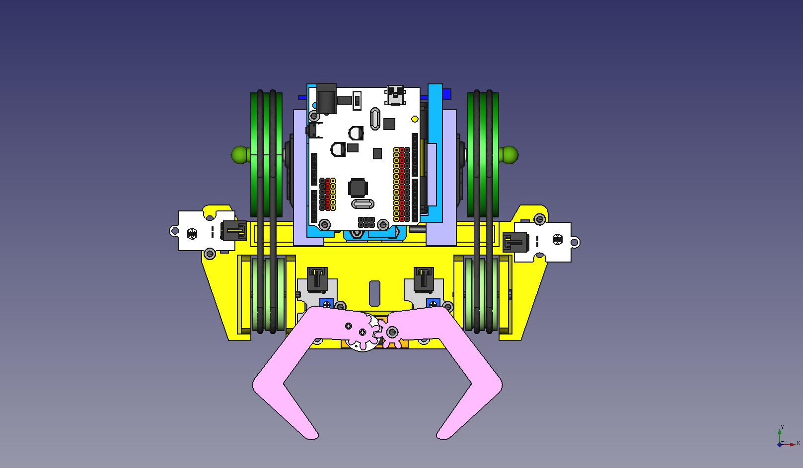
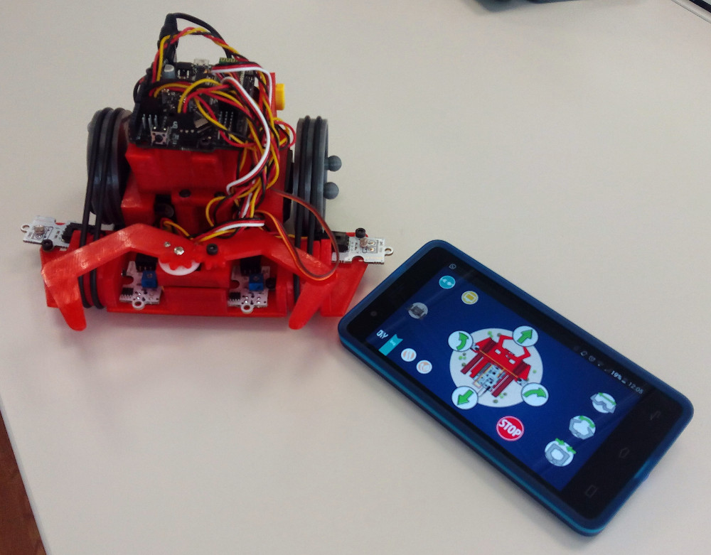
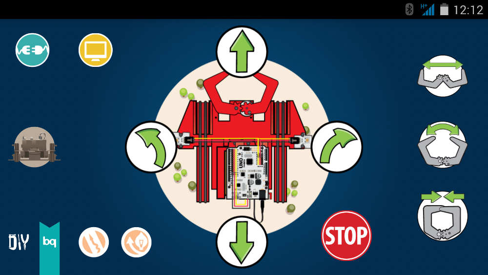

<table>
<tr>
<td>

</td>
</tr>
</table>

# Printbot Beetle

In this repository you will find the source files for the [bq Printbot Beetle](http://diwo.bq.com/product/kit-printbot-beetle/). If you are missing something, please do not hesitate to [file an issue on github](https://github.com/bq/printbots/issues)

En este repositorio se encuentran los ficheros fuente del [Printbot Beetle de bq](http://diwo.bq.com/product/kit-printbot-beetle/). Si echas en falta algo, no dudes en [rellenar una tarea en github](https://github.com/bq/printbots/issues)

# Directory structure

 * `legacy`: Older versions

 * `freecad`: Beetle source files in [FreeCAD](http://www.freecadweb.org/)

 * `stl`: Parts exported to stl. Ready for printing

 * `step`: Parts exported to step format

 * `sw-examples`: Programming examples (for Arduino compatible boards)

 * `images` : Beetle images

 * `beetle-BOM.ods`: Bettle Bill of Materials. Document for [LibreOffice](https://www.libreoffice.org/).

# Beetle Assembly in Freecad

In the Freecad folder there is an Assembly of the printbot Beetle. The source files for the vitamins (servos, board, nuts, bolts, etc) are available in the [Freecad part library](https://github.com/yorikvanhavre/FreeCAD-library)

  **All the source files for the parts in the assembly are available**

# Robopad++: Controlling the Robot from your android smartphone

The printbot beetle can be controlled using your **smartphone**. You need a bluetooth module connected to your freaduino / Arduino board (or using the ZUM BT-328 which already include an embebbed bluetooth module)

  Install the [Robopad++](https://github.com/bq/robopad-plusplus) app available from the Google play store. It is open source, released under the GPL license. Check the [robopad++ github](https://github.com/bq/robopad-plusplus)

  You can find **more information on how to install and use this application** in [this Diwo post](http://diwo.bq.com/robopad-3/)

# License 

This printbot is licensed under a [Creative Commons Attribution-ShareAlike 4.0 International License](http://creativecommons.org/licenses/by-sa/4.0/). Please read the LICENSE files for more details.

Este printbot tienen una licencia [Creative Commons Attribution-ShareAlike 4.0 International License](http://creativecommons.org/licenses/by-sa/4.0/). Por favor, lea los ficheros LICENSE para más detalles

# CREDITS
* **Jon Goitia**: Original design (Beetle V1.0). It is a derivative of his own [mini rover printbot](http://www.thingiverse.com/thing:18392)
* **David Sanchez**: migration to freecad of the rear wheels and servo-screw-cover. Adaptation to Beetle v1.2
* **Ana de Prado**: programming examples
* **Estefanía Sarasola**: Robopad++ app
* **Juan Gonzalez** (Obijuan): Migration to freecad of the beetle parts. Adaptation to v1.2. New assembly in Freecad

