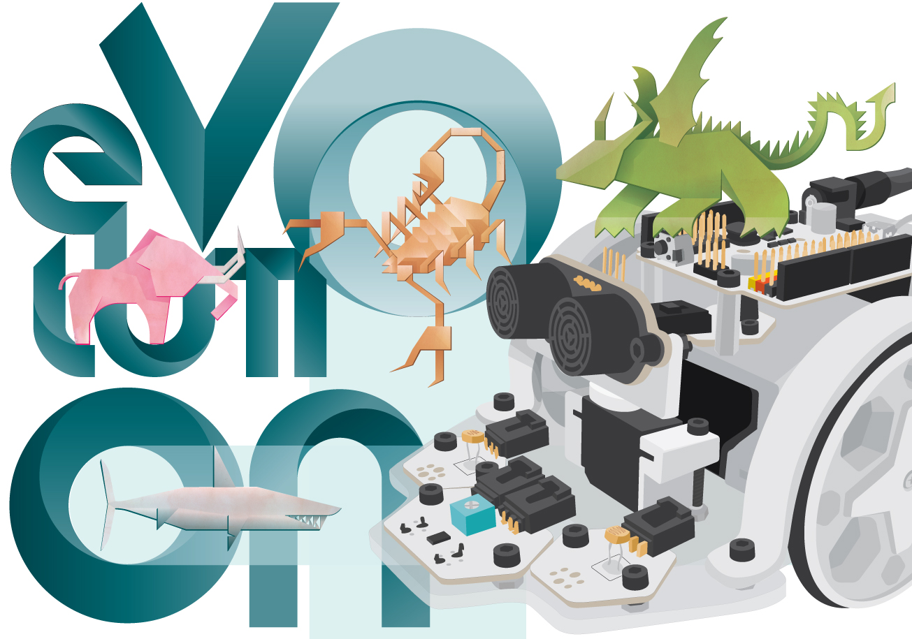
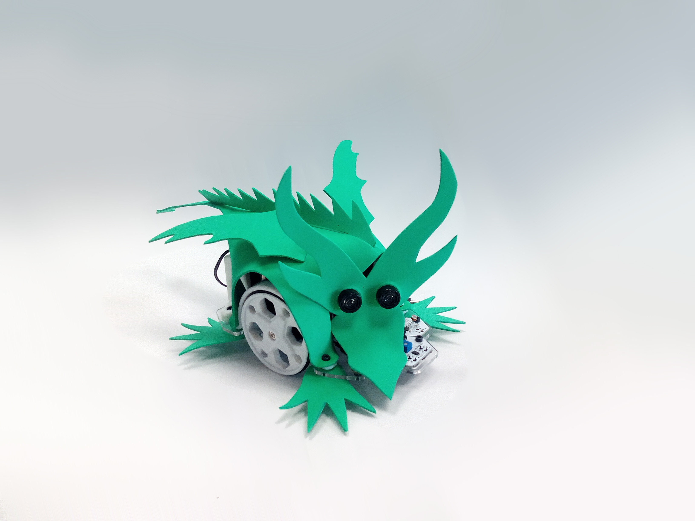

# Printbot Evolution

<i>Printbot Evolution V.1.0</i>

In this repository you will find the source files for the [bq Printbot Evolution](http://diwo.bq.com/montaje-del-printbot-evolution/). If you are missing something, please do not hesitate to [file an issue on github](https://github.com/bq/printbots/issues)

En este repositorio se encuentran los ficheros fuente del [Printbot  Evolution de bq](http://diwo.bq.com/montaje-del-printbot-evolution/). Si echas en falta algo, no dudes en [rellenar una tarea en github](https://github.com/bq/printbots/issues)

<i>Printbot Evolution with Dragon Skin</i>

# Directory structure

 * `freecad`: Evolution source files in [FreeCAD](http://www.freecadweb.org/)

 * `stl`: Parts exported to stl. Ready for printing

 * `step`: Parts exported to step format

 * `Media` : Evolution images

 * `dxf` : .dxf files

 * `Skins_layout` : Skin layouts files

 * `addons` : New pieces and other stuff to expand the Evolution

 * `Evolution-BOM.ods`: Evolution Bill of Materials. Document for [LibreOffice](https://www.libreoffice.org/).

# Evolution Assembly in Freecad

In the Freecad folder there is an Assembly of the printbot Evolution. The source files for the vitamins (servos, board, nuts, bolts, etc) are available in the [Freecad part library](https://github.com/yorikvanhavre/FreeCAD-library)

# License

This printbot is licensed under a [Creative Commons Attribution-ShareAlike 4.0 International License](http://creativecommons.org/licenses/by-sa/4.0/). Please read the LICENSE files for more details.

Este printbot tienen una licencia [Creative Commons Attribution-ShareAlike 4.0 International License](http://creativecommons.org/licenses/by-sa/4.0/). Por favor, lea los ficheros LICENSE para más detalles

# CREDITS

* **Pedro de Oro Martín**: Printbot original design and skins design; Dragon and Scorpion.
* **Federico Figueiredo de Sousa**: Skins design; Elephant and Shark.
* **Ana de Prado Navarrete**: Programming examples.
* **Sonia Verdú Calatayud and Leonor Sanahuja**: Layout of templates.
* **Julián Caro Linares**: Bumper design.
* **Jokin Lacalle**: Derivative acrylic base adapted for individuals IR.
