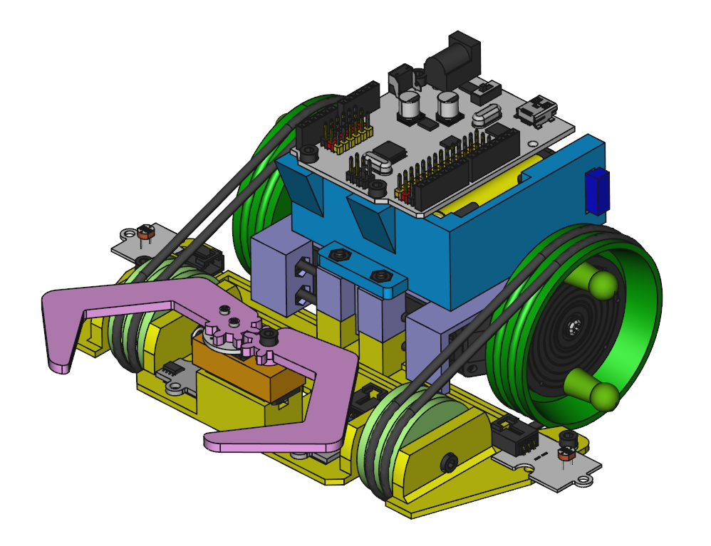

<table>
<tr>
<td>

</td>
</tr>
</table>

# BQ Printbots

In this repository you will find the source files for the **bq printbots**. If you are missing something, please do not hesitate to [file an issue on github](https://github.com/bq/printbots/issues)

En este repositorio se encuentran los ficheros fuente de los **Printbots de bq**. Si echas en falta algo, no dudes en [ rellenar una tarea en github](https://github.com/bq/printbots/issues)

 | 
:-------------: | :-------------:
[Printbot Beetle](http://diwo.bq.com/product/kit-printbot-beetle/)|[Printbot Beetle](http://diwo.bq.com/product/kit-printbot-beetle/) 

# License 

All the printbots are licensed under a [Creative Commons Attribution-ShareAlike 4.0 International License](http://creativecommons.org/licenses/by-sa/4.0/)

Please read the LICENSE files for more details.

Todos los printbots tienen la licencia [Creative Commons Attribution-ShareAlike 4.0 International License](http://creativecommons.org/licenses/by-sa/4.0/)

Por favor, lea los ficheros LICENSE para más detalles

